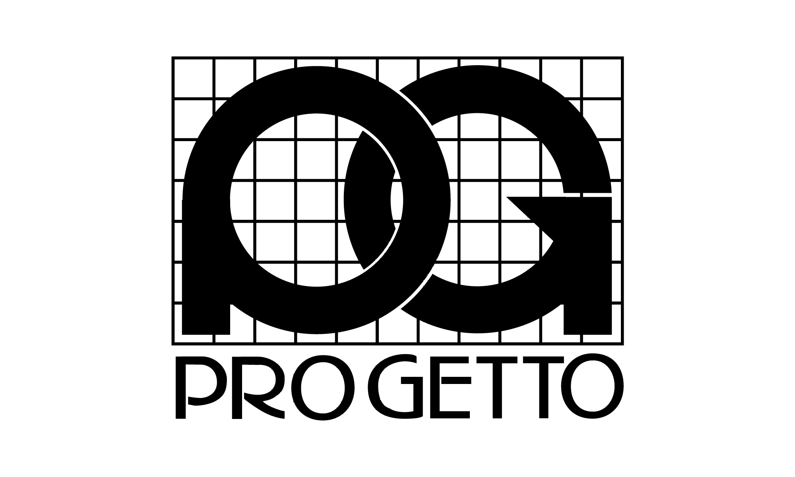

## 目次
  - [会社概要](#anchor-about)
  - [事業内容](#anchor-info)
    - [1-1．キット同梱品](#1-1キット同梱品)
    - [組立前にお客様自身で準備いただく部品](#jump)
    - [1-3．組立後でも取り付けられる部品とオプション](#1-3組立後でも取り付けられる部品とオプション)
  - [２．準備](#２準備)
    - [2-1．必要な工具](#2-1必要な工具)
    - [2-2．ファームウェア](#2-2ファームウェア)
  - [３．実装](#３実装)

## 会社概要

| 項目 | 内容 |
| --- | --- |
| 商号 | 有限会社プロゲット |
| 設立 | 1990年5月1日 |
| 代表取締役 | 志水 佑 |
| 資本金 | 500万円 |
| 従業員数 | 5名 |
| 本社 | 〒470-0124 愛知県日進市浅田町上納87番地 |
| 第2工場 | 〒470-0128 愛知県日進市浅田平子2丁目50番地 |
| TEL | 052-807-6971 |
| FAX | 052-807-6972 |

## 事業内容
有限会社プロゲット(Progetto CO., Ltd.)は、  
「製品」の企画・設計・製作の受託開発を行う＜法人＞ですが、資本主義の手からそれを一度預かり、控えめな創造力を加味して「試作品」として返すものです。
製品が要求する「design = 意匠、設計」について、「progettazione = プロジェクトを考えて実践する」客体として、技術的専門分化に抗う＜作り手＞が集い、それを考え直す「避難地 = アジール、ヘイヴン」でありたいと考えています。

### 領域
- 基礎 … BMC・調査企画・仕様検討・要件定義・資料作成
- 機械設計 … RE・機械設計・機構設計・筐体設計・艤装設計・製図
- 電装設計 … 測定・解析・評価・回路設計・基板設計・ファーム設計・ソフト設計・組込み・実装
- 製作組立 … CAM・機械工作・造形・表面処理・加飾・組立・調整・動作確認

### 設備
- MC(切削加工機)
  - OKK VP600 (1台 / xyz移動量：1000×600×450)
  - MDX-540S (3台 / xyz移動量：400×400×155)
- 汎用機
  - 彫刻機
  - ブラスト加工機
  - アーク溶接機
  - エアツール他、一般工具一式
- 塗装ブース

### ソフトウェア/開発環境
- **CAD :** CATIA V5, Rhino 8
- **CAM :** Craft MILL, SRP Player
- **ELEC :** Visual Studio Code(C, C#, C++, Python), Github, KiCad, Visio

### 体制
1. 特化 … 「PoC」及び「プロトタイプ」製作に特化する(※1)
1. 集約 … 各領域内の分業をせず、最少人数で意思の集約を図る
1. 水平化 … 全領域の基礎的な作業を全社員で担う
1. 社外 … 3Dプリンター(FDM・粉末・光・インクジェット)、5軸マシニングセンタ、金属加工機(切削・板金)、注型等、導入や運用に多大なコストを要する製作設備はあえて保有しておりません。  
上記の必要が生じた場合、部品製作のみを協力会社様に依頼することでトータルの要求品質に応えつつ、自社としては抽象度の高いR&Dの起点に集中して携わる実験工房でありたいと考えています

---

### 1-1．キット同梱品

# 採用情報

## 募集職種

### 1. 電気設計者

**仕事内容**
試作装置や展示用モックアップなどの組み込み開発および製作を担当していただきます。

**応募資格**
- 電気回路設計の経験
- 組込みソフトウェア開発の経験 (C, C++, Pythonなど)
- ものづくりが好きな方

**歓迎するスキル**
- 3D CADの使用経験
- プロジェクトマネジメントの経験

---
<a name="jump">組立前にお客様自身で準備いただく部品</a>

### 2. メカ設計者

**仕事内容**
試作装置や展示用モックアップなどの設計および製作を担当していただきます。

**応募資格**
- 3D CADを使用した機械設計の経験
- 材料力学、機械力学の知識
- ものづくりが好きな方

**歓迎するスキル**
- 構造解析、熱解析の経験
- 加工、組立の経験

---
---

## 募集要項

| 項目 | 内容 |
| --- | --- |
| 雇用形態 | 正社員 |
| 給与 | 月給XXX,XXX円 |
| 勤務地 | 愛知県日進市 |
| 勤務時間 | 9:00～18:00 |
| 休日・休暇 | 土日休み、夏季休暇、年末年始休暇 |
| 選考プロセス | 面接1回→内定 |

## 応募方法

以下のメールアドレスまで、履歴書・職務経歴書を添付の上、ご応募ください。

**採用担当**
tasuku.shimizu@pro-getto.com
